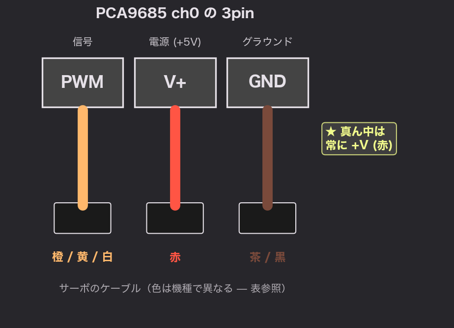
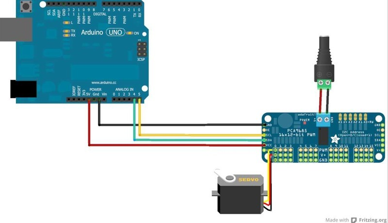
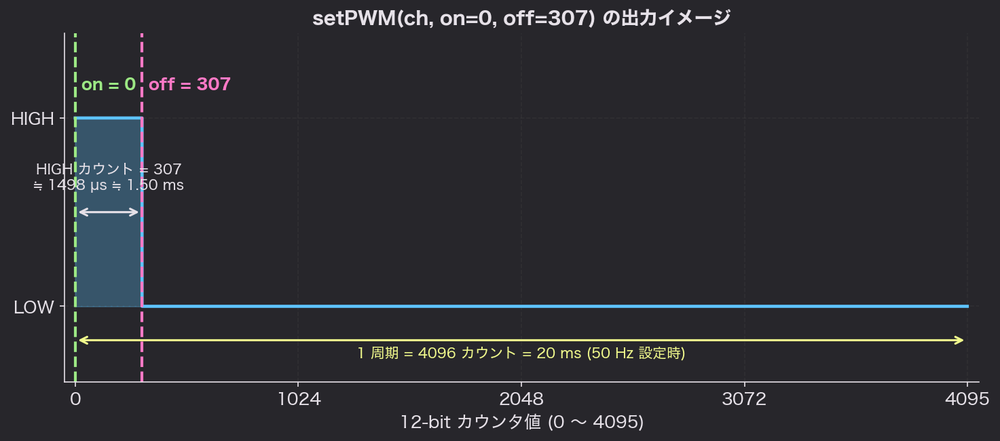

# Chapter 1: 1 個のサーボを動かす

> ⚠ 配線・電源接続を伴います。実施前に [免責事項](../README.md#免責事項) を必ずご確認ください。

## 学習目標

- Arduino Uno と PCA9685 を正しく配線できる
- ライブラリをインストールしてサンプルを書き込める
- `setPWMFreq()` と `setPWM()` の意味と使い方を説明できる
- 自分のサーボに合わせて `SERVOMIN` / `SERVOMAX` をキャリブレーションできる

## 準備するもの

- Arduino Uno
- Adafruit PCA9685 ボード
- RC サーボ × 1（SG90 でも MG996R でも OK）
- サーボ用電源（5V 1A 以上のスイッチング電源 or 4×単3 電池ボックス）
- ジャンパワイヤ、USB ケーブル

## 配線

### Arduino ↔ PCA9685

| Arduino Uno | PCA9685 |
|-------------|---------|
| 5V          | VCC     |
| GND         | GND     |
| A4 (SDA)    | SDA     |
| A5 (SCL)    | SCL     |

### サーボ電源（緑のスクリュー端子）

| サーボ電源 | PCA9685 |
|-----------|---------|
| +5V       | V+      |
| GND       | GND     |

### サーボ本体

サーボのコネクタを **ch 0** の 3pin に挿します。
PCA9685 ボード上の 3pin はシルクで `PWM / V+ / GND` の順に印字されているので、
**サーボの GND 線（黒 or 茶）が GND ピン側**に来るように挿します。



#### サーボの 3 線の見分け方

RC サーボのケーブル色は **メーカーによって異なります**。
ただし、ほぼ全メーカーで次の暗黙ルールが守られています。

> 💡 **真ん中の線は必ず +V（電源）**

これさえ覚えておけば、誤接続でサーボを焼く確率は大幅に下がります
（電源を逆に挿すとサーボ・基板側どちらも壊す可能性があります）。

代表的な色対応:

| メーカー | GND | +V (中央) | PWM (信号) |
|---------|-----|-----------|-----------|
| Tower Pro / 汎用（一番多い） | **茶** | 赤 | **橙** |
| Futaba（旧 J ）   | **黒** | 赤 | **白** |
| JR              | **黒** | 赤 | **橙** |
| Hitec           | **黒** | 赤 | **黄** |

判別のコツ:

1. **真ん中はほぼ赤** → +V
2. **両端のうち暗い方**（黒 or 茶）→ GND
3. **両端のうち明るい方**（白・黄・橙）→ PWM 信号

確認の手段:

- 手持ちサーボ型番でメーカーの **データシート / 製品ページ**を確認するのが最も確実
- 不安なら **テスタの導通モード**で GND ピン（Arduino の GND など既知の GND）と
  サーボの黒（茶）線の導通を確かめる
- PCA9685 のシルク印刷と照らし合わせ、**逆挿しになっていないか目視確認**してから通電する

### 全体配線図


*出典: [Adafruit Industries](https://learn.adafruit.com/16-channel-pwm-servo-driver/hooking-it-up), CC BY-SA 3.0*

- 黒/赤: GND と 5V（Arduino → PCA9685 VCC）
- 青/黄: SDA / SCL（A4 / A5 → PCA9685 SDA / SCL）
- 右上の DC ジャック: **サーボ専用電源**（V+ 緑端子）
- ボード下端: ch 0 にサーボの 3pin を挿す

> ⚠ **GND は必ず Arduino・PCA9685・サーボ電源で共通**にしてください。
> ここを忘れるとサーボがブルブル震えるだけで動きません。

## ライブラリのインストール

開発環境ごとに方法が違います。どちらか片方でOK。

### Arduino IDE の場合

1. Arduino IDE を起動
2. メニュー：**Tools → Manage Libraries...**（または **Sketch → Include Library → Manage Libraries...**）
3. 検索欄に `adafruit pwm` と入力
4. **Adafruit PWM Servo Driver Library** を選んで [Install]
5. 依存ライブラリのインストールを求められたら **Install all** を選択

### VS Code + PlatformIO の場合

各 example フォルダの `platformio.ini` に依存記述済みなので、**何もする必要はありません**。

```ini
lib_deps =
    adafruit/Adafruit PWM Servo Driver Library
```

初回ビルド（`pio run` または ✓ アイコン）時に自動ダウンロードされます。

> PlatformIO 自体のセットアップが未完の方は、
> [VSCode + PlatformIO + Arduino セットアップ資料 (Notion)](https://tasty-eyeliner-3a3.notion.site/VSCode-PlatformIO-Arduino-333e1b8189ac800bb65cef402e3702c0)
> を先にご覧ください。本チュートリアル固有のメモは [付録 D](appendix-d-platformio.md) にまとめています。

## 最初のスケッチ

`examples/01_single_servo/01_single_servo.ino` として保存してあります
（PlatformIO 派は同フォルダの `platformio.ini` ごと VS Code で開いてください）。

内容を順を追って見ていきましょう。

```cpp
#include <Wire.h>
#include <Adafruit_PWMServoDriver.h>

// PCA9685 のインスタンス（デフォルトアドレス 0x40）
Adafruit_PWMServoDriver pwm = Adafruit_PWMServoDriver();

// --- キャリブレーション値（サーボごとに調整） ---
#define SERVO_FREQ   50     // サーボの標準は 50 Hz
#define SERVOMIN    150     // パルス幅の最小カウント（≒0.6 ms）
#define SERVOMAX    600     // パルス幅の最大カウント（≒2.4 ms）

// 動かすチャンネル
#define CH 0

void setup() {
  Serial.begin(9600);
  Serial.println("Single servo test start");

  pwm.begin();              // I2C 開始 + チップ初期化
  pwm.setPWMFreq(SERVO_FREQ); // PWM 周波数を 50 Hz に設定

  delay(10);
}

void loop() {
  // 0° (SERVOMIN) → 180° (SERVOMAX) へ
  for (int p = SERVOMIN; p <= SERVOMAX; p++) {
    pwm.setPWM(CH, 0, p);
    delay(5);
  }
  delay(500);

  // 180° → 0° へ戻す
  for (int p = SERVOMAX; p >= SERVOMIN; p--) {
    pwm.setPWM(CH, 0, p);
    delay(5);
  }
  delay(500);
}
```

### コードのポイント

#### `pwm.begin()`
PCA9685 のレジスタを初期化し、I²C 通信を開始します。
**`setup()` で 1 回だけ**呼びます。

#### `pwm.setPWMFreq(50)`
PCA9685 の出力周波数を 50 Hz（周期 20 ms）に設定します。
サーボの標準値です。これも `setup()` で 1 回だけ。

#### `pwm.setPWM(channel, on, off)`
12-bit カウンタが `on` の値で HIGH に立ち上がり、`off` で LOW に落ちるイメージです。
ふつう `on = 0` 固定で、`off` の値だけを変えれば「パルス幅 = `off` カウント分」になります。



## キャリブレーション（最重要）

サーボには個体差・機種差があり、実際の可動範囲はカタログ値と一致しません。
**スケッチをそのまま動かすと、ギアが「ガリッ」と限界に当たって壊れる**ことがあります。

### 手順

1. まず安全側に寄せて `SERVOMIN = 200`, `SERVOMAX = 500` などで起動
2. シリアルモニタや決め打ち値で少しずつ広げる
3. **「もうちょっとで動かなくなるな」という手前**で止める
4. 余裕を 20〜30 カウント残した値を採用

### キャリブレーション用スケッチ（抜粋）

```cpp
// シリアルモニタから数値を入力するとそのカウントで動かす
void loop() {
  if (Serial.available() > 0) {
    int p = Serial.parseInt();
    if (p >= 100 && p <= 700) {
      Serial.print("setPWM("); Serial.print(p); Serial.println(")");
      pwm.setPWM(CH, 0, p);
    }
  }
}
```

シリアルモニタから `150` `200` `300` …と打って、安全な範囲を探します。
完成版は `examples/01b_calibration/01b_calibration.ino` に置いてあります。

## やってみよう（演習）

1. ch 0 のサーボを 0 → 90° → 0° → -90° → 0° と動かすコードを書け
2. シリアルモニタから角度（-90〜90）を入力すると、その角度に動くスケッチを書け
   - ヒント: `map(angle, -90, 90, SERVOMIN, SERVOMAX)`
3. サーボを別のチャンネル（ch 1, ch 2, ...）に挿し替えて、同じコードで動くことを確認せよ

## まとめ

- 配線は **GND 共通・サーボ電源は別系統** が鉄則
- `pwm.setPWM(ch, 0, count)` の `count` を 0〜4095 で指定すると角度が決まる
- 50 Hz 設定では 1 カウント ≒ 4.88 µs
- `SERVOMIN` / `SERVOMAX` は **必ず実機で実測**すること

次の Chapter 2 では、複数のサーボを同時に動かしたときに起きる
**「全部バラバラに着地しちゃう」問題**を体験します。

---

[◀ Chapter 0 へ](00-pca9685-overview.md) | [▶ Chapter 2 へ](02-multi-servo.md)
