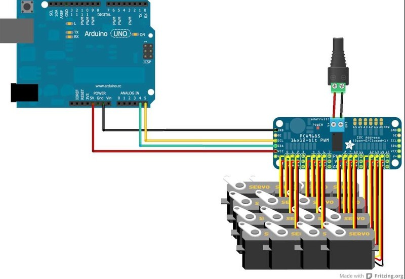

# Chapter 2: 複数サーボを同時に動かす

## 学習目標

- `setPWM()` を for ループで複数チャンネルに送る方法を理解する
- I²C 通信に「時間がかかる」感覚を持つ
- **「同時に命令」しても「同時に到着」しない問題**を実機で体験する
- なぜ Ch 3 で時間補間が必要になるのか、自分の言葉で説明できる

## 準備するもの

- Chapter 1 の構成 + サーボをあと 3 個（合計 4 個）
- ch 0〜ch 3 にそれぞれ接続


*出典: [Adafruit Industries](https://learn.adafruit.com/16-channel-pwm-servo-driver/hooking-it-up), CC BY-SA 3.0*

ケーブルがごちゃつくので、**各 ch のサーボにマスキングテープでラベル**をつけておくと
後のキャリブレーションが格段に楽になります。

## まずは動かしてみる

4 個のサーボを **「全部同じ角度」** に動かすのは簡単です。

```cpp
#include <Wire.h>
#include <Adafruit_PWMServoDriver.h>

Adafruit_PWMServoDriver pwm = Adafruit_PWMServoDriver();

#define SERVO_FREQ 50
#define SERVOMIN 150
#define SERVOMAX 600

const int NUM_SERVOS = 4;
const int CH[NUM_SERVOS] = {0, 1, 2, 3};

void setup() {
  pwm.begin();
  pwm.setPWMFreq(SERVO_FREQ);
}

void loop() {
  // 4個まとめて SERVOMIN へ
  for (int i = 0; i < NUM_SERVOS; i++) {
    pwm.setPWM(CH[i], 0, SERVOMIN);
  }
  delay(1000);

  // 4個まとめて SERVOMAX へ
  for (int i = 0; i < NUM_SERVOS; i++) {
    pwm.setPWM(CH[i], 0, SERVOMAX);
  }
  delay(1000);
}
```

これは **4個ともだいたい同時に動いて、同時に止まる**はずです。
…なぜなら、4個とも「同じ距離」を動くからです。

## I²C 通信の所要時間

`pwm.setPWM()` を 1 回呼ぶと、Arduino は I²C 経由で PCA9685 に
「ch X、on カウント = a、off カウント = b」というコマンドを送ります。

おおまかに 1 コマンド ≒ **0.5 〜 1 ms** ほどかかります（標準 100 kHz の場合）。
4 個に送ると合計 2〜4 ms。
人間にはほぼ「同時」ですが、サーボの可動時間（数百 ms）に比べると無視できるレベルです。

> 💡 PCA9685 には全 16ch 同時更新用の機能（`setOutputMode` や ALLLED レジスタ）もありますが、
> ここでは普通に 1ch ずつ送る方式で十分です。

## ❗ ここからが本題: 距離が違うと「バラバラ」になる

サーボの「角度ごとの動く速さ」は機種によって決まっています（例: SG90 は 0.1 sec/60°）。
つまり、**移動距離が大きいほど、目標到達まで時間がかかる**わけです。

次のコードは「全部を一斉に発射」しますが、目標の距離はバラバラです。

`examples/02_multi_servo/02_multi_servo.ino`

```cpp
const int CH[NUM_SERVOS] = {0, 1, 2, 3};

void loop() {
  // 一斉に「ホームポジション」へ
  for (int i = 0; i < NUM_SERVOS; i++) {
    pwm.setPWM(CH[i], 0, SERVOMIN);
  }
  delay(1500);

  // それぞれ違う距離だけ動かす
  int targets[NUM_SERVOS] = {
    SERVOMIN + 50,    // ch0: ちょっとだけ
    SERVOMIN + 150,   // ch1: 少し
    SERVOMIN + 300,   // ch2: わりと大きく
    SERVOMAX          // ch3: 全力で
  };

  // 「同時に命令」
  for (int i = 0; i < NUM_SERVOS; i++) {
    pwm.setPWM(CH[i], 0, targets[i]);
  }

  delay(1500);
}
```

### 観察

実行して 4 個のサーボの動きを横から見てください。
**ch0 は瞬時に止まり、ch3 はまだウィーンと動き続けている**はずです。

これが **「同時に命令しているのに同期していない」** 状態です。

```
時刻 →

ch0  ━●               (距離小→すぐ止まる)
ch1  ━━━●
ch2  ━━━━━━━━●
ch3  ━━━━━━━━━━━━━━●  (距離大→遅れて到着)

       ↑                  ↑
     スタート             バラバラの到着時刻
```

## なぜ「同期」が大事なのか

4 脚ロボットでは、たとえば「右前脚を上げる」動作で
**股関節サーボ + 膝サーボ**を同時に動かす必要があります。

- 股関節だけ先に動いて、膝が遅れて曲がる
  → 足先が変な軌跡を描く（机に引っかかる、変な姿勢になる）
- 4 本の脚を同時にスタートさせる動作
  → 各脚の各関節が同じ瞬間に到着しないと、ロボットが転倒する

つまり、**「目標角度を送る」だけではダメで、「いつ着くか」も揃える**必要があります。

## 解決アプローチの予告

ナイーブな解決策はこうです。

> 「目標をいきなり送らず、**現在位置から目標位置までを細かい step に分割**して、
>  各 step で全サーボに少しずつ命令を送る。
>  step を `K 回 × 1 step あたり Δt ms` で実行すれば、
>  **全サーボが時刻 K×Δt に揃って到着する**。」

これを実装するのが **Chapter 3: 同期制御 = 時間補間** です。

## やってみよう（演習）

1. 上のスケッチを実機で動かして、ch3 だけ遅れて止まるのを **目視で確認**せよ
2. `targets` の値を全部同じにすると、本当に「同時に止まる」か確認せよ
3. `delay(1500)` を `delay(300)` まで縮めると何が起こるか観察せよ
   （命令が早すぎて、前の動作が終わる前に次が来る）
4. 1 回の `loop()` 内で `Serial.println(millis())` を使って、
   命令の前後で経過時間が何 ms かかったか測れ
   （ヒント: 4回の `setPWM` でどれくらい時間が消費されるか？）

## まとめ

- `setPWM()` を for ループで呼べば複数サーボに連続命令できる
- I²C 通信時間は短いので、命令タイミングは「ほぼ同時」
- でも **距離が違えば到着時刻はバラバラ**になる
- これがロボット制御で「同期」が必要になる根本原因
- 解決は **時間補間（time-based interpolation）**＝Chapter 3

---

[◀ Chapter 1 へ](01-single-servo.md) | [▶ Chapter 3 へ](03-synchronized-motion.md)
