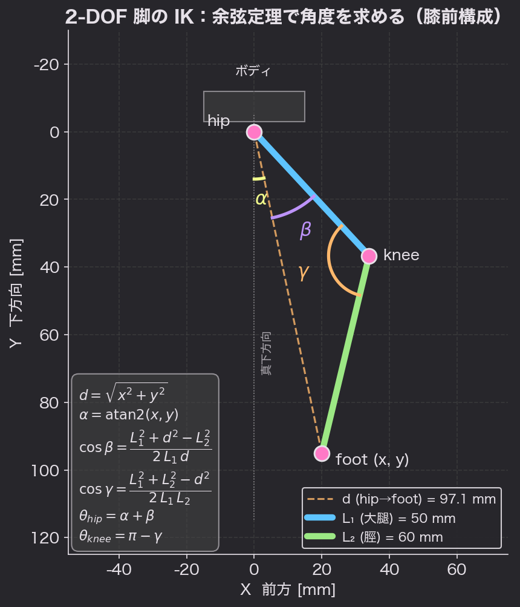
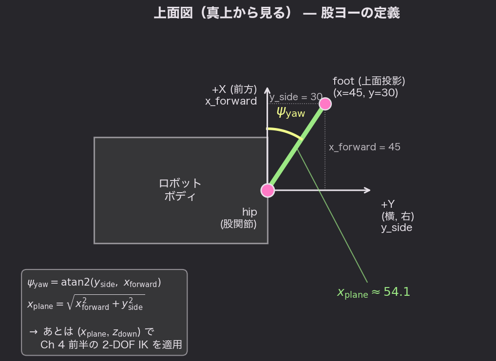

# Chapter 4: 1脚の運動学入門

## 学習目標

- 「順運動学（Forward Kinematics, FK）」と「逆運動学（Inverse Kinematics, IK）」の違いを説明できる
- 2-DOF 平面リンク脚の IK を **余弦定理**を使って導出できる
- 3-DOF（股ヨー追加）への拡張ができる
- 「足先 (x, y, z) [mm]」を入力すると「サーボ角度 → PWMカウント」に変換できる

## なぜ運動学が必要か

ここまでは「サーボに角度を送る」段階でした。
でも歩行ロボットを作るときに本当にやりたいのは：

> **「足先をこの位置に置きたい」**
> （例: 前方に 80 mm、下に 100 mm）

…という **足先座標** の指定です。
そこから **各サーボがいくつになるべきか** を計算するのが **逆運動学（IK）** です。

```
       やりたいこと:
          脚先座標 (x, y, z) [mm]
                  ↓
              （ここを計算！）
                  ↓
       股ヨー角・股ピッチ角・膝角 [°]
                  ↓
            PWMカウント [0〜4095]
                  ↓
              setPWM()
```

## FK と IK

| 名前 | 入力 | 出力 | 難易度 |
|------|------|------|--------|
| **FK**（順運動学） | 関節角度 | 足先座標 | 簡単（公式に代入するだけ） |
| **IK**（逆運動学） | 足先座標 | 関節角度 | やや難（多解・解なしあり） |

ロボットの実用ではほぼ常に IK が必要です。

## 2-DOF 平面脚の IK

まずは **横から見たときの 2 関節リンク**（股ピッチ + 膝）を考えます。



- 原点：股関節（hip）
- X 軸：前方を正
- Y 軸：下向きを正
- L1：大腿（thigh）リンク長
- L2：脛（shin）リンク長
- 足先：`(x, y)` [mm]

### 求めたい角度

- **θ_hip**：大腿が「真下方向」から前にどれだけ傾いているか（前傾＝正）
- **θ_knee**：膝が「まっすぐ」からどれだけ曲がっているか（0 = 完全伸展）

### 余弦定理を使った導出

足先までの直線距離：

```
d = √(x² + y²)
```

ここで三角形 hip - knee - foot に **余弦定理（Law of Cosines）** を適用します。

角度 `α` を「真下から足先方向への角度」、
角度 `β` を「大腿と足先方向のなす角」と定義すると（上図参照）：

```
α = atan2(x, y)                              … 足先の向き
cos(β) = (L1² + d² − L2²) / (2 · L1 · d)     … 余弦定理
β = acos(cos(β))

θ_hip  = α + β    … 大腿の前傾角（膝前構成）
```

> 💡 IK には数学的に **2 つの解**があり、`α + β` は「膝が前に出る」自然な4脚ロボットの構成、
> `α − β` は「フラミンゴ脚」（膝が後ろ）になります。本教材では前者を採用します。

膝角度は、膝の内角 `γ` を求めて 180° との差を取ります：

```
cos(γ) = (L1² + L2² − d²) / (2 · L1 · L2)
γ = acos(cos(γ))
θ_knee = π − γ    … まっすぐで0、曲がるほど大きい
```

### 到達不能なケース

- `d > L1 + L2` → **遠すぎ**（足が届かない）
- `d < |L1 − L2|` → **近すぎ**（折り畳んでも入らない）

このときは IK を計算せず、エラーを返します。

### C 言語での実装

```cpp
#include <math.h>

// IK計算結果を hipAngle / kneeAngle [rad] に格納
// 戻り値: true = 到達可能, false = 不可
bool ik2d(float x, float y, float L1, float L2,
          float *hipAngle, float *kneeAngle) {
  float d = sqrtf(x * x + y * y);
  if (d > L1 + L2) return false;        // 遠すぎ
  if (d < fabsf(L1 - L2)) return false; // 近すぎ

  float alpha   = atan2f(x, y);
  float cosBeta = (L1 * L1 + d * d - L2 * L2) / (2.0f * L1 * d);
  if (cosBeta >  1.0f) cosBeta =  1.0f;
  if (cosBeta < -1.0f) cosBeta = -1.0f;
  float beta    = acosf(cosBeta);

  float cosGamma = (L1 * L1 + L2 * L2 - d * d) / (2.0f * L1 * L2);
  if (cosGamma >  1.0f) cosGamma =  1.0f;
  if (cosGamma < -1.0f) cosGamma = -1.0f;
  float gamma    = acosf(cosGamma);

  *hipAngle  = alpha + beta;   // 大腿の前傾 [rad]（膝前構成）
  *kneeAngle = (float)M_PI - gamma; // 膝の曲げ [rad]
  return true;
}
```

## 3-DOF への拡張（股ヨー追加）

実際の 4 脚ロボットの多くは、**股を左右にも振れる**ように
3 つ目のサーボ（股ヨー、hip yaw）を持っています。



上から見ると、足先の **水平位置** `(x_forward, y_side)` から **股ヨー角 ψ** が決まります。
ヨーで脚を回転させたあとは、ヨー軸を含む鉛直平面内に
**距離 `x_plane = √(x_forward² + y_side²)`** だけ離れた位置に足先がある状態になり、
そこに対して Ch 4 前半の **2-DOF IK**（股ピッチ + 膝）を適用すれば 3-DOF 全体が解けます。

### 計算手順

1. 足先座標を `(x_forward, y_side, z_down)` の 3D で指定
2. **ヨー角**を計算
   ```
   θ_yaw = atan2(y_side, x_forward)
   ```
3. ヨーで回した後の「脚の作業面内」の前方距離
   ```
   x_plane = √(x_forward² + y_side²)
   ```
4. その平面で **Ch 4 前半の 2-DOF IK** を `(x_plane, z_down)` に対して適用

### コード

```cpp
bool ik3d(float xf, float ys, float zd, float L1, float L2,
          float *yaw, float *hip, float *knee) {
  *yaw = atan2f(ys, xf);
  float xp = sqrtf(xf * xf + ys * ys);
  return ik2d(xp, zd, L1, L2, hip, knee);
}
```

## サーボ角 → PWM カウントへの変換

IK から出てくるのは **ラジアン**ですが、サーボに送るのは **PWM カウント** (`SERVOMIN`〜`SERVOMAX`) です。

そして次の3点を脚ごとに調整する必要があります。

1. **取り付け方向**：サーボの正回転と「角度＋方向」が一致するとは限らない（左右で反転）
2. **ゼロオフセット**：機構を組んだとき、サーボ角 0 が幾何モデルの 0 と一致するとは限らない
3. **可動範囲**：物理的にぶつからない範囲に制限

これらを構造体にまとめると見通しが良くなります。

```cpp
struct ServoCal {
  uint8_t channel;     // PCA9685 のチャンネル番号
  int     pwmMin;      // 機械可動範囲の最小 PWM カウント
  int     pwmMax;      // 機械可動範囲の最大 PWM カウント
  float   angleAtMin;  // pwmMin に対応する関節角 [rad]
  float   angleAtMax;  // pwmMax に対応する関節角 [rad]
  float   offset;      // 機構ゼロ補正 [rad]
  int     direction;   // +1 or -1（取り付け方向）
};

int angleToPWM(const ServoCal &s, float angle_rad) {
  float a = s.direction * angle_rad + s.offset;
  // a が [angleAtMin, angleAtMax] の何%かを求める
  float t = (a - s.angleAtMin) / (s.angleAtMax - s.angleAtMin);
  if (t < 0.0f) t = 0.0f;
  if (t > 1.0f) t = 1.0f;
  return s.pwmMin + (int)((s.pwmMax - s.pwmMin) * t);
}
```

これで `setPWM(s.channel, 0, angleToPWM(s, hipAngle))` のように
**「IKで出した角度をそのまま渡せば良い」** 形になります。

## 例: 1脚を IK で動かしてみる

```cpp
// リンク長（自分のロボットに合わせて変更）
const float L1 = 50.0f;  // 大腿 50 mm
const float L2 = 60.0f;  // 脛   60 mm

// この脚の3個のサーボのキャリブレーション
ServoCal yawCal  = { /* ch=0, ... */ };
ServoCal hipCal  = { /* ch=1, ... */ };
ServoCal kneeCal = { /* ch=2, ... */ };

void moveFootTo(float xf, float ys, float zd, int duration_ms) {
  float yaw, hip, knee;
  if (!ik3d(xf, ys, zd, L1, L2, &yaw, &hip, &knee)) {
    Serial.println(F("IK unreachable"));
    return;
  }
  int targets[3] = {
    angleToPWM(yawCal,  yaw),
    angleToPWM(hipCal,  hip),
    angleToPWM(kneeCal, knee)
  };
  // Chapter 3 で作った同期動作で移動
  startMove(targets, duration_ms);
}
```

完成版は `examples/04_leg_ik/04_leg_ik.ino` を参照してください。

## やってみよう（演習）

1. `L1 = 50, L2 = 60` で `(x, y) = (0, 100)` の IK 結果を **手計算と比較**せよ
2. `(x, y) = (200, 0)` を渡して、`ik2d` が `false` を返すことを確認せよ
3. 自分のロボットの 1 脚で、足先を **半径 30 mm の円**を描かせるコードを書け
   - パラメトリック表現: `x(t) = cx + r·cos(t),  y(t) = cy + r·sin(t)`
4. 円を「楕円」にして、平らな床面を擦るような動きにしてみよ
   （これが歩行のスイング軌道の原型です）

## まとめ

- **IK = 足先座標 → 関節角度の逆計算**
- 2-DOF 脚は余弦定理で解ける（`atan2` + `acos`）
- 3-DOF 脚は「ヨー → 平面に投影 → 2-DOF IK」で組める
- IK で出した角度はキャリブレーション構造体で PWM に変換
- ここまで来ると、Chapter 3 の同期動作と組み合わせて
  「足先軌跡を描く」コードが書けるようになる

次の Chapter 5 では、いよいよ **歩行ゲイト**（脚の動かし方のパターン）を設計します。

---

[◀ Chapter 3 へ](03-synchronized-motion.md) | [▶ Chapter 5 へ](05-walking-gaits.md)
