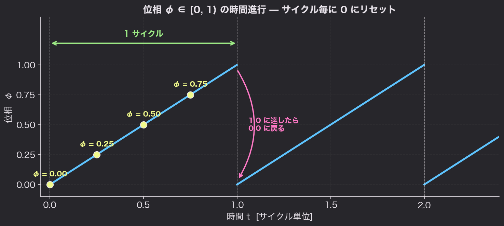
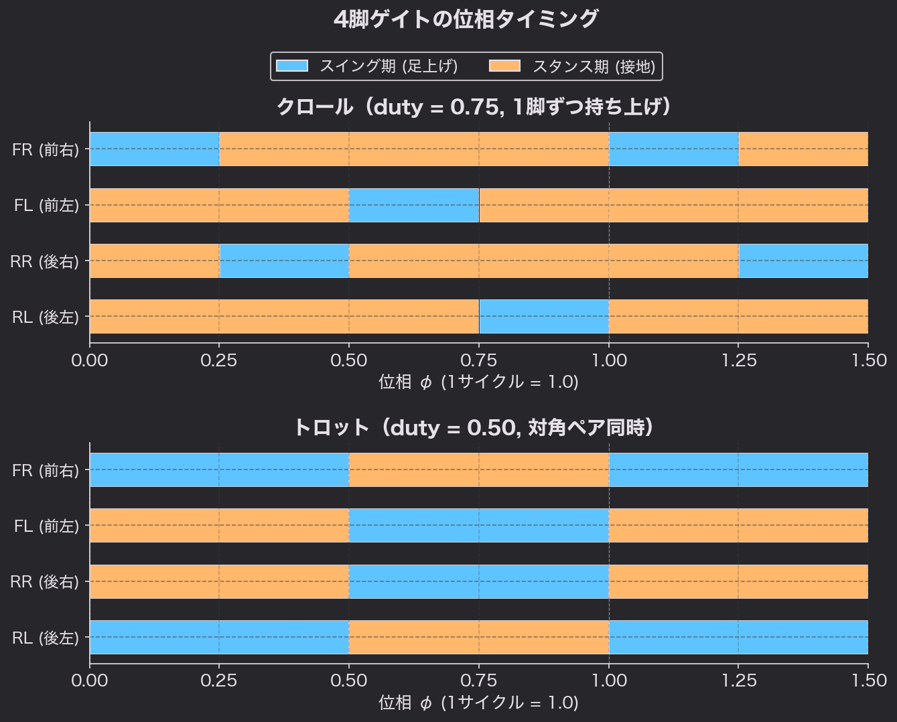
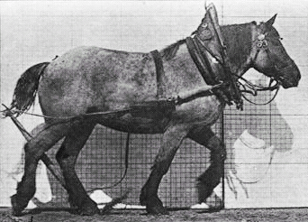
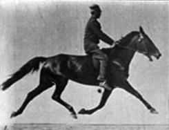
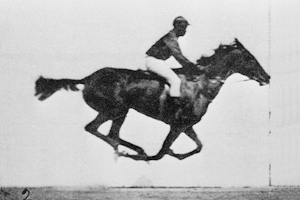
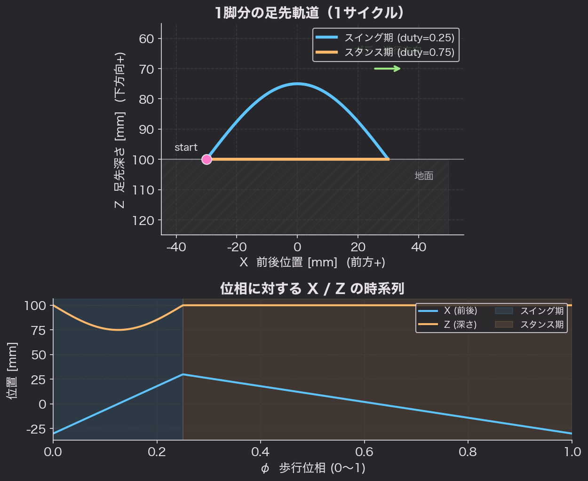

# Chapter 5: 4脚歩行ゲイト

## 学習目標

- 「ゲイト（gait）」「位相（phase）」「デューティ比（duty factor）」を説明できる
- クロール／トロット／バウンドなど代表的な 4 脚ゲイトの違いを理解する
- 各脚の足先軌跡を **スイング期 + スタンス期** に分けて設計できる
- 1つの **位相変数 φ ∈ [0, 1)** から 4 脚分の足先座標を生成できる

## ゲイトとは

**ゲイト（gait, 歩容）** = 4本（あるいは複数）の脚を **どんなタイミング・順番**で動かすかのパターン。

人間の「歩く」「走る」「スキップ」も別のゲイト。
4脚動物では大きく以下のように分類されます。

| ゲイト | 同時に上がる脚 | 安定性 | 速度 | 例 |
|-------|---------------|--------|------|------|
| クロール（walk）| 1本ずつ | ◎ 最も安定 | 遅い | 馬の歩み・はじめの一歩 |
| トロット（trot） | 対角線2本 | ○ | 中速 | 馬の速歩・ロボット定番 |
| ペース（pace）  | 同側2本 | △ | 中速 | ラクダ |
| バウンド（bound）| 前2本 / 後2本 | × | 高速 | 犬・ウサギの跳び |

**初学者は「クロール」から始めるのが一番転びにくいです。**

## 用語整理

### 位相（phase）φ

「歩行サイクルの今どこにいるか」を 0.0 〜 1.0 の数で表す変数です。
1サイクル経過すると 0 に戻ります（鋸波）。



#### 📚 コラム: 位相を `[0, 1)` で扱う理由

歩行制御で位相を表現する方法は複数あります。**どれも数学的には等価**ですが、目的によって選び方が違います。

| 表現 | 範囲 | よく使われる場面 |
|------|------|-----------------|
| **`[0, 1)`** | 0 を含み 1 を含まない | **ロボット制御コード（汎用、本教材もこれ）** |
| `[0, 2π)` | ラジアン | 位相結合振動子モデル（CPG）、神経科学系の研究 |
| `[0, 360°)` | 度数 | 教科書、機械系の歩容解析、人間にとって直感的 |

本教材で `[0, 1)` を採用している理由は次の4点です。

1. **`mod 1.0` でラップアラウンドが自然**
   `phase = (phase + dt / cycle_time) % 1.0` の一言で済む。
2. **`duty` などの「割合」と同じスケール**
   `duty = 0.75` と `phase < 0.25` を**換算なしに直接比較**できる。
3. **単位を気にしなくていい**
   `rad` ⇄ `deg` の `* PI / 180` を書かなくてよい。
4. **足先軌道に渡しやすい**
   `footTrajectory(phase)` の中で 0〜1 のまま `sin(π * phase)` や線形補間に使える。

##### `1` を含める？（半開 vs 閉区間）

慣習的には **`1` は含めない**（半開区間 `[0, 1)`）。
`phase = 1.0` は `phase = 0.0` と同じ位置を指す **巡回変数（cyclic variable）** だからです。
コードでは

```cpp
phase += dt / cycle_time;
if (phase >= 1.0f) phase -= 1.0f;     // 1.0 になったら 0.0 へ折り返し
```

のように `>= 1.0` で折り返すのが定石。

##### 補足：CPG（中央パターン生成器）系の研究

神経科学寄りのロボット研究（蔵本モデル、Matsuoka oscillator、CfC 等）では、
位相を **`[0, 2π)`** あるいは **複素単位円** `e^{iφ}` で表すことが多くなります。
位相結合を `sin(φᵢ − φⱼ)` のような形で滑らかに表現するためです。
本教材は **アルゴリズム的なゲイト生成** なので、シンプルさを優先して `[0, 1)` を採用しています。

### 各脚の位相オフセット

脚 ID を `FR`（前右）, `FL`（前左）, `RR`（後右）, `RL`（後左）とします。
**各脚の「自分の位相」**は、グローバル位相に **オフセット**を足したもの：

```
φ_leg = (φ_global + offset_leg) mod 1.0
```

オフセットの組合せでゲイトが決まります（後述）。

### デューティ比（duty factor）

1サイクルのうち、**足が地面に着いている時間の割合**。

- 0.75 → クロール（4本中3本がいつも接地）
- 0.50 → トロット
- 0.25 以下 → ギャロップ（走る）

数式で書くと：

```
脚の状態:
  if φ_leg < (1 - duty)    → スイング期（lifted, 前進）
  else                       → スタンス期（grounded, 後退）
```

> 💡 慣習的にスイング期を先（φ_leg = 0 から）にする本が多いです。
> 本教材もそれに合わせます。

## 代表ゲイトの位相設計

下図がクロールとトロットの位相タイミングです。
青がスイング期（足上げ）、橙がスタンス期（接地）。



### クロール（4-beat walk）

**1本ずつ順番に**持ち上げる、一番安定なゲイト。
duty = 0.75 が定石で、**常に 3 脚が地面に着いている**ので倒れにくい。

| 脚 | offset |
|----|--------|
| FR | 0.00 |
| RL | 0.25 |
| FL | 0.50 |
| RR | 0.75 |

### トロット（2-beat diagonal）

**対角の2本を同時に**動かす、4脚ロボットの定番。
duty = 0.50。スイング中は対角の2本だけが接地するので、
バランス制御がやや必要。重心が低いロボットなら大丈夫。

| 脚 | offset |
|----|--------|
| FR + RL | 0.00 |
| FL + RR | 0.50 |

### 動画で見る（実際の馬のゲイト）

ロボットの歩容は**馬や犬の歩き方**を参考にしているので、実際の動物の動きを見ると理解が早いです。
下の3つは Eadweard Muybridge（1887）の連続写真アニメーション（パブリックドメイン）。

| ゲイト | 馬の例（GIF） |
|-------|-------------|
| **クロール（walk）** |  |
| **ペース（pace）**  |  |
| **バウンドに近い（gallop）** |  |

> 出典: [Eadweard Muybridge "Animal Locomotion" (1887)](https://commons.wikimedia.org/wiki/Category:Horse_motion_studies_by_Eadweard_Muybridge), パブリックドメイン

**トロット（trot）**は対角ペアが同期する 2-beat 歩行です。動画で見たい場合は次が分かりやすい:

- Wikipedia 記事の動画セクション: [Horse gait — Trot (Wikipedia, EN)](https://en.wikipedia.org/wiki/Horse_gait#Trot)
- YouTube 解説: [Gaits of Horses](https://www.youtube.com/watch?v=xCWMI09F5O8)（walk → trot → canter → gallop の比較）

## 足先軌跡（foot trajectory）

各脚は、自分の `φ_leg` から **足先の (x, y, z) 座標** を計算します。

ボディ基準で考えるとシンプルです。
- **スタンス期**: 足は地面に接したまま、ボディの動きと逆向きに後退
- **スイング期**: 足を持ち上げて、後方→前方へ移動



上段が側面から見た足先軌跡（半円が足上げ、地面上の直線が接地）。
下段は同じ動きを位相 φ に対して X / Z 各成分で展開した時系列です。

### スイング期の足先座標（半円トラジェクトリ）

- 前後方向（x）: 後端 → 前端 へ直線で前進
- 上下方向（z）: `sin` で持ち上がって戻る

```cpp
// φ_swing: スイング期内の進行度 (0.0 〜 1.0)
float xf = -stride/2 + stride * φ_swing;          // 後ろ→前へ
float zd = z_default - step_height * sinf(M_PI * φ_swing);
```

### スタンス期の足先座標（直線で後退）

- 前後方向（x）: 前端 → 後端 へ直線で後退（ボディが前進する分の反作用）
- 上下方向（z）: 接地高さ固定

```cpp
// φ_stance: スタンス期内の進行度 (0.0 〜 1.0)
float xf = stride/2 - stride * φ_stance;          // 前→後ろへ
float zd = z_default;                              // 地面に接地
```

### まとめると（疑似コード）

```cpp
void footPosition(float phase_leg, float *xf, float *ys, float *zd) {
  const float duty = 0.75f;            // スタンス比
  const float stride = 60.0f;          // 歩幅 [mm]
  const float step_height = 25.0f;     // 持ち上げ高さ [mm]
  const float z_default = 100.0f;      // 標準接地高 [mm]
  const float swing_dur = 1.0f - duty;

  if (phase_leg < swing_dur) {
    // スイング期
    float p = phase_leg / swing_dur;   // 0..1
    *xf = -stride/2 + stride * p;
    *zd = z_default - step_height * sinf(M_PI * p);
  } else {
    // スタンス期
    float p = (phase_leg - swing_dur) / duty;  // 0..1
    *xf = stride/2 - stride * p;
    *zd = z_default;
  }
  *ys = 0.0f;  // 直進なら横方向は0、旋回するときは曲げる
}
```

## ゲイト切り替えの設定例

```cpp
// クロール（4-beat walk）
const float OFFSET_CRAWL[4] = {0.00f, 0.50f, 0.75f, 0.25f};
// 順番: FR, FL, RR, RL
const float DUTY_CRAWL = 0.75f;

// トロット（2-beat diagonal）
const float OFFSET_TROT[4]  = {0.00f, 0.50f, 0.50f, 0.00f};
const float DUTY_TROT  = 0.50f;
```

`OFFSET[]` と `DUTY` をその場で差し替えればゲイトが切り替わります。

## 旋回（turning）の作り方

直進ばかりではつまらないので、旋回も触れておきます。

> **左旋回**するなら：
> - 右側の脚（FR, RR）の `stride` を **大きく**
> - 左側の脚（FL, RL）の `stride` を **小さく** または逆向き

つまり「車のキャタピラ式」と同じ発想です。
コードでは脚ごとに `stride` を持たせて、左右で値を変えるだけ。

## やってみよう（演習）

1. 紙の上に **クロール / トロット / ペース** の各脚位相タイミング図を書け
2. `phase_leg` をシリアルから入力すると、その位相での足先 (x, z) を表示するスケッチを書け
3. 4本の脚で `phase_global` を 0 → 1 まで動かしたとき、
   いずれも接地脚が **2本以上**ある（重心が支えられる）か検証せよ
4. （発展）スイング期の `sin` を **2次曲線**や **台形**に置き換えて、軌跡の違いを観察せよ

## まとめ

- ゲイト = 各脚の位相オフセットと duty で表現できる
- クロール（duty=0.75, 1本ずつ） は最も安定で初学者向け
- トロット（duty=0.5, 対角同時）は速いが要バランス
- 1脚あたりの足先軌跡は **スイング期（持ち上げ）+ スタンス期（後退）**
- 旋回は左右の `stride` を変えるだけで作れる

次の Chapter 6 では、Chapter 3〜5 を **全部組み合わせて**、
4脚ロボットを実際に歩かせる完成版コードを作ります。

---

[◀ Chapter 4 へ](04-leg-kinematics.md) | [▶ Chapter 6 へ](06-gait-generator.md)
